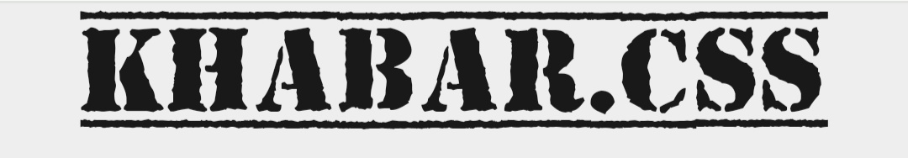

<a href = "https://www.npmjs.com/package/khabar.css"></a>

# khabar.css 


## About
Khabar.css (read as खबर, which means news) is a CSS library which lets the web developers build a uniquely styled UI which resembles like a newspaper.
Find more info on its [documentation](https://minku-singh.github.io/khabar.css/) website.

## Installation

Fastest way to use Khabar.css is to import it from unpkg.
```
<link 
    rel = "stylesheet"
    href = "https://unpkg.com/khabar.css"    
>
```

or,

Having [node](https://nodejs.org/en/) installed in your machine, use
``` 
npm install khabar.css
```

## Features
- Serves a uniquely styled newspaper like UI.
- It comes with the components which are responsive on all screen sizes.

### Components
Find info about usage of all the components on [documentaion](https://minku-singh.github.io/khabar.css/docs/usage.html) website.

- Alert 
    - Standard Alerts
- Avatar
    - Standard Avatar 
    - Avatar with Status
- Badge
    - Avatars with Badge
    - Icons with Badge
- Button
    - Solid Button
    - Outline Button
    - Button with Icon
- Card
    - Responsive Card
- Footer
- Image
    - Responsive Image
    - Circular Image
- Input
    - Standard Input
    - Input Validation
- List
    - Standard List
- Navigation
- Toast

## Author
- https://github.com/minku-singh
- https://twitter.com/minkusinghh

Give it a 🌟, if you liked it!!
Contributions are welcomed 🥤